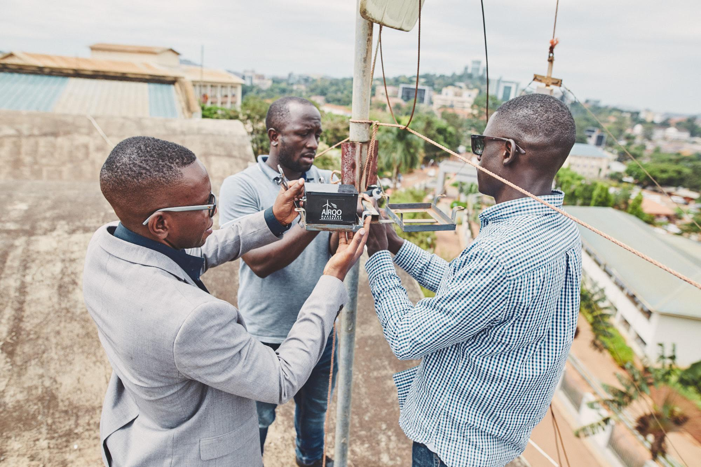
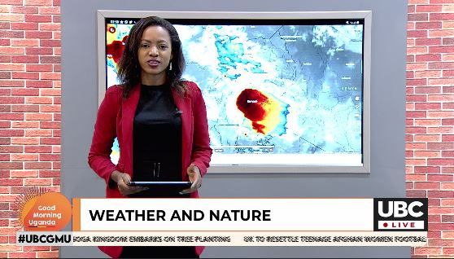
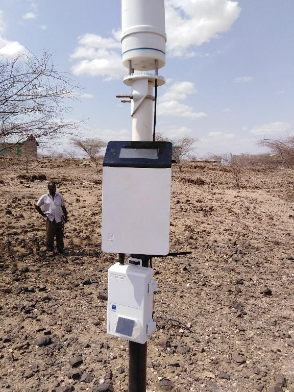

# __AirQo Ugandan Air Quality Forecast Challenge__
## __Description__
Until recently there has been a lack of data on air quality across sub-Saharan Africa. Reference grade monitors are extremely expensive and without access to data it is very difficult to raise awareness of the issues, or for government, business and individuals to know which actions to take to improve air quality and protect community health.

AirQo has built a low-cost network of sensors and collected data across 65 locations in Uganda with some sites monitoring for over three years. There is now a wealth of data which can be used to achieve impact in this critical area. Birmingham University’s ASAP project makes use of this and similar data to gain insights into the relationship between urbanization and air quality.


##### source: AirQo

<br />

The increase in availability of air quality data allows us to analyse historical and up to the minute results to gain insights into trends, hot-spots, causes and consequences of poor air, potential policy solutions and so much more.

The ability to accurately predict what air quality will be in the coming days is also essential for empowering everyone from governments to families to make informed decisions to protect health and guide action, just as we do with weather.

Activities that are known to contribute to poor air quality such as high traffic volumes, rubbish burning, cooking using charcoal and firewood, even construction or other government works can also be reconsidered depending on the forecast.

If it is known that the next day will be a high pollution day then sports or other events may need to be rescheduled or relocated. Sensitive groups such as children, the elderly, sick or those with respiratory illnesses may need to remain inside. Schools can plan the timing of outdoor activities such as field trips or sports events with confidence.

We are hopeful that these forecasts will be used to inform public awareness and be built into safety alerts. They can become part of daily news coverage whether in traditional or social media in the same way weather is currently presented. The solution could literally be life saving.

This is a challenge which was created on Zindi, the data science competition platform with the mission of building the data science ecosystem in Africa.

The objective of this challenge is to accurately forecast air quality (as measured by PM2.5 µ/m3) for each hour of the coming 25 hours across five locations in Kampala Uganda. Forecasts will be based on the past 5 days of hourly air quality measurements at each site.

Zindi provided .csv files with train and test data but also meta data with location details. The meta data was excluded in our project.

[More details about the challenge](https://zindi.africa/competitions/airqo-ugandan-air-quality-forecast-challenge)

---

## __Stakeholder__
We selected UBC as our stakeholder for this project. The Uganda Broadcasting Corporation (UBC) is the public broadcaster network of Uganda. 
UBC wants to expand their weather forecast and include the air pollution for each hour of the coming 25 hours across five locations in Kampala Uganda. The population should be warned by high pollution and the health concern to act accordingly.


##### source: UBC

---

## __Data__
The weather indicators available in the train and test are:

* __temp:__ mean temperature recorded at the site over the hour (in degrees Celsius)
* __precip:__ precip for precipitation, in this project precip is used for total rainfall in mm recorded at the site over the hour (in mm)
* __rel_humidity:__ mean relative humidity recorded over the hour (in %)
* __wind_dir:__ mean direction of the wind over the hour (in degrees N)
* __wind_spd:__ mean wind speed at the site over the hour (in metres per second)
* __atmos_press:__ mean atmospheric pressure (atm)


##### source: TAHMO

<br />

Each series of weather and air quality readings will be associated with a unique sensor. Each of the five sensors will have a set of features.

* meta data by location: one of either A, B, C, D or E referring to the five different locations selected
    * location details 
    * distance to motorways and roads
    * waste incineration and fuels in private kitchens (firewood, coal)

---

## __Our files:__

* The [final notebook](https://github.com/IronMan2483/Projects/tree/main/Project_2/notebook) with EDA, plots, predictions and error analysis.
* The [slides](https://github.com/IronMan2483/Projects/blob/main/Project_2/Project%202_%20ML-Uganda_Team%20RPK.pdf) for the selected stakeholder.

---
## __Requirements:__

- pyenv with Python: 3.9.4
- MetPy: 1.1.0
- Yellowbrick: 1.3post1


### __Environment__

Use the requirements file in this repo to create a new environment.

```
pyenv local 3.9.4
python -m venv .venv
source .venv/bin/activate
pip install --upgrade pip

brew update
brew install node

pip install jupyterlab "ipywidgets>=7.5"
jupyter labextension install jupyterlab-plotly@4.14.3
jupyter labextension install @jupyter-widgets/jupyterlab-manager plotlywidget@4.14.3
````

---

## __Limitations__

Development libraries are part of the production environment. Normally these would be separate as the production code should be as slim as possible.
